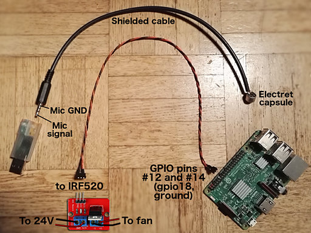
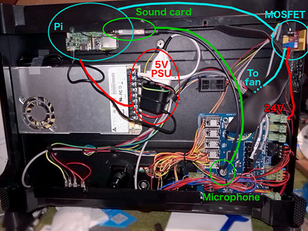

# MightyVariableFan

*Variable fan speed workaround for 3D printers based on the MightyBoard, like the FlashForge Creator Pro*<br>
by Alexander Thomas, aka Dr. Lex

*This is still in an experimental stage! Some issues still need to be resolved.*


## What is it?

**In short,** this adds *full variable print cooling fan speed* capability to printers like the FlashForge Creator Pro, by means of a kind of modem connection between the printer and a Raspberry Pi.

**The long story:** the MightyBoard, as used in printers like the FlashForge Creator Pro, has one annoying limitation, and it is lack of **PWM ability for the cooling fan.** The fan is connected to the ‘EXTRA’ output on the board, and this output is only a binary toggle, meaning the fan can only be off or at full throttle. This makes it impossible to get optimal results with filaments that require a small or moderate amount of cooling, and there are many other reasons why one would want to vary the speed of the fan. Slicer programs like Slic3r offer advanced fan speed control, but it is worthless with only a binary toggle.

It is possible to recompile Sailfish firmware with a software PWM implementation on the EXTRA output, but this is only a static control that cannot be changed mid-print, and it cannot be controlled through G-code commands either. Installing a simple manual hardware PWM controller is actually a better option because that will at least allow to change the PWM at any time, but it remains cumbersome. I have done this for a few months until I got tired of having to babysit every print. I wanted fully automatic fan control from within the X3G file itself.

I have looked for sensible ways to implement PWM for the fan, in such a way that it could be controlled from within G-code, preferably with manual override. Ideally, the printer should send desired fan speed to a separate device like an Arduino or Raspberry Pi, which does the actual PWM. I found no sensible solution however, so I went for something *less sensible* instead. This solution relies on the **buzzer,** which from my experiments has proven to be a reliable one-way communication channel. Not only does it play tones with accurate timings, it also plays them exactly where they occur inside the print code, unlike the M126 and M127 commands that will toggle the EXTRA output at a rather unpredictable time before the command is expected to be executed.

To make all this work, you need some minimal understanding of Linux, and at least basic electronics skills. Being able to solder might not be essential, but will make it much easier than trying to find ready-made cables that will fit. While working on the internals of your printer, take the usual precautions for working on delicate electronics: avoid static discharges and short-circuits.

This has so far only been tested with *Slic3r,* and quite likely the post-processing script that generates the beep sequences will only work with Slic3r-generated G-code at this moment. Of course, the main reason why I have published this on GitHub is to make it easy for anyone to modify the code and submit pull requests to make it work with other slicer programs.

Mind that this is still in an **experimental stage.** See the *Current Issues* section at the bottom. This has only been tested with prints from the SD card, because I don't print through USB.


### How It Works

1. A **post-processing script** called *pwm_postprocessor.py* on your local computer takes G-code with M106 fan speed commands as input, and outputs the same code with those commands replaced by M300 beep commands. These play very specific sequences of 3 high-pitched blips using 4 specific frequencies. This allows to encode 64 levels, which is plenty for controlling a fan. This script also manipulates the speeds to optimize them (see ‘advantages’ below). For this to work, you need to let your slicer program generate G-code that contains M106 commands, meaning you will need to output for *RepRap* instead of Sailfish.
2. A **Raspberry Pi** mounted inside the printer runs a Python daemon called *beepdetect.py*, that continuously listens to audio input from a simple USB sound card. A **microphone** attached to this card, is placed directly above the printer's buzzer. The script uses an FFT to detect the specific frequencies of the blips.
3. When beepdetect.py detects a sequence, it performs an HTTP call to a simple Python-based web server that also runs on the Pi, this is the *pwm\_server.py* script based on CherryPy.
4. The pwm\_server reacts to incoming calls that request a speed change, by manipulating PWM output on a GPIO pin of the Pi, this is done through the RPi.GPIO Python module (which only implements software PWM, but this is good enough for controlling a fan at low frequency).
5. The GPIO pin controls a simple **MOSFET** break-out board that switches the 24V of the main printer PSU. The fan is connected to this MOSFET's output.


### Advantages

This approach, crazy as it may seem, has quite a few advantages:
* No irreversible modifications to your printer are needed. Although some soldering may be needed to construct the cables for the microphone and GPIO, you do not need to solder anything on your printer. The only requirements are glueing in some 3D printed mounts for the Pi and MOSFET, re-wiring the fan, and mounting a power supply for the Pi. These can all fit inside the spacious insides of an FFCP.
* You do not need to recompile anything. If you would have attempted to do all this stuff inside a heavily hacked Sailfish build, next to that build itself you would also have needed to hack and rebuild the GPX program, and possibly your slicer, because otherwise you would have no way of getting the fan speed arguments in an X3G file.
* Decoupling the PWM controller from the printer's firmware allows to add all kinds of advanced control, without having to modify the printer or recompiling firmware. For instance, the PWM server controller has a kickstart feature to allow the fan to start at very low speeds, and to more quickly reach intermediate speeds.
* The post-processing script can optimize fan speeds and timings. It can ensure the fan will have spun up at the right time, and it can gradually ramp up fan speed between the first layers and higher ones. The latter is very important with most cooling duct designs, because at lower layers the cooling may otherwise be excessive due to air being forced in between the platform and the extruders.
* If your Pi has a WiFi connection, the fan PWM server can be reached through any portable device like your smartphone, and you can manipulate fan speed at any time.
* The PWM server offers temporary override of fan behavior, or a permanent manual override, useful for experimenting or in case you suddenly notice you have misconfigured the cooling for a print that would be a pity to abort.
* Fan duty cycles as low as 1% can be used even from standstill, thanks to the kickstart.
* If you already have installed a Raspberry Pi in your printer to have a camera feed or control other parts of the printer, you only need to install a USB sound card with microphone, an extra MOSFET, and some wires.
* If someone finds a less crazy way of making the printer communicate with the Pi, only the beepdetect and pwm_postprocessor scripts need to be updated.


### Disadvantages

* There is only one obvious disadvantage: the printer will be making a bit of extra noises, as if R2D2 is trying to subtly get your attention. These blips are very short though, and are played at frequencies the buzzer cannot play loud anyway. Thanks to these two choices, the blips don't really stand out above the usual printer noises.
* A less likely problem is that if your printer is placed next to a pen with pigs that can squeal *extremely* loud at the exact same frequencies as the blips, detection might fail. Please don't combine 3D printing with pigs. More realistic sources of disturbances are nearby machines that make loud hissing noises, or a loud music system very near to the printer. In my setup however, I couldn't even trigger any responses with the detector in debug mode without making unreasonably loud noises.

If you would suffer from one or both of these problems, they can be reduced or eliminated in several ways. The first way is to print a sealed adapter for attaching the microphone to the buzzer instead of a half-open one. This both attenuates the blips to a nearly inaudible level, and reduces influence of external noises.

If you're not afraid of soldering on your printer's main board, you can omit the microphone and make a direct electrical connection between the buzzer contacts (marked ‘BUZZ BUZZ’) and the USB sound card. You should make the connection through a decoupling capacitor, and possibly add a resistor divider to attenuate the signal if necessary. This eliminates the outside noise problem completely. Moreover, you can unsolder the buzzer as well if you want to mute it entirely. This ReadMe won't explain how to do all these things: I assume that if you are prepared to solder on your printer's main board, you also have sufficient knowledge how to make this kind of connection correctly.


## Installing

### Step 1: gather the required hardware

You need:
* A **Raspberry Pi** that has sufficient oomph to run the beep detector, and also WiFi (not strictly essential, but recommended). I am not sure whether a Pi 2 suffices, but a 3B certainly does. These things are not expensive anyway, so if you already have an old Pi inside your printer, this might be a good time to upgrade it. There is a pretty good place to mount the Pi in the underside of the printer, by using [3D printed brackets](https://www.thingiverse.com/thing:2852432) that can be glued in place.
* A small **5V power supply** for your Pi. Ideally, it should be small enough to fit inside your printer. I used a simple off-the shelf supply ([this one](https://www.conrad.be/p/raspberry-pi-netvoeding-sp-5c-zwart-raspberry-pi-3-b-1462834) to be exact) that I could tuck under a bundle of wires inside the printer. I connected it to the mains contacts of the printer's PSU, so the Pi is toggled together with the rest of the printer. If you have a choice between multiple supplies that fit, pick the one with the most flexible cable and the most compact microUSB plug. This is where you'll have to be a bit creative with parts you can find in local stores. You could take apart a USB power supply to more easily connect it to the mains, or you could plug the supply into half an extension cord, like I did. Whatever you do, do not create dubious and dangerous constructions that expose mains voltage.
* A **USB sound card.** It will be much easier if it is as small as possible. I recommend to buy one of those extremely cheap ‘3D sound’ sticks with a yellow and green 3.5mm jack. These are rather crappy, but very compact, well supported in Linux, and for the purpose of this application they are good enough. The plastic case of these cards is unnecessarily large; to make it much easier to fit inside your printer, you can print [this custom case](https://www.thingiverse.com/thing:2822474) if it fits your model of sound card (if not, modifying the model should be easy).
* A tiny **microphone** that can be mounted very close (within 10 mm) to the buzzer. I recommend to build your own microphone with a standard electret capsule (9.7mm diameter), a bit of shielded cable, and a 3.5mm plug. This can be mounted perfectly onto the buzzer with a [3D printed part](https://www.thingiverse.com/thing:2852499).
* A **24V MOSFET** break-out board. There is a very common one for the IRF520, which is very easy to mount inside the printer with yet another [printed part](https://www.thingiverse.com/thing:2852499). (Given the low gate voltage provided by the Pi, this MOSFET should not be used to switch high currents. For switching the cooling fan it is perfectly adequate however.)
* A **cable** to connect the GPIO pins on the Pi to the MOSFET. It is best to solder your own, using low-profile or angled plugs, because space may be tight depending on where you will mount the Pi.


### Step 2: prepare the Raspberry Pi

On your Pi, assuming you are running Raspbian Stretch or newer, you need to ensure the following Debian packages are installed. You can run `sudo aptitude` to install them in a console UI, or simply do `sudo apt-get install` followed by a space-separated list of the package names:
* python3-scipy
* python3-pyaudio
* python3-cherrypy3
* python3-requests-futures
* python3-rpi.gpio

Next, copy the following files from this project to `/usr/local/bin/` on your Pi, and make them all executable:
* beepdetect.py
* pwm_server.py
* shutdownpi
* startpwmservices
* stoppwmservices

After logging in to the Pi and placing those files (and only those) in a folder ‘stuff’, you can get them in the right place with these commands:
```
cd stuff
chmod a+x *
sudo mv * /usr/local/bin/
```
You also need to copy the *pwm_server* directory (with the CSS file inside it) into `/home/pi/`.

Finally, add the following line before the “`exit 0`” line in `/etc/rc.local`. You need root permissions for this, for instance use: `sudo nano /etc/rc.local` or: `sudo vim.tiny /etc/rc.local` depending on your preferred editor.
```
/usr/local/bin/startpwmservices
```
Before mounting the Pi in your printer, you should also configure everything else to your likings, for instance the WiFi connection, SSH access with public key, change the hostname, … You should also disable everything you don't need, for instance you should most likely disable the graphical X environment unless you really need it for an attached display. Anything that could produce an unpredictable burst of activity should be disabled to avoid interference with the beep detector.<br>
If you are really adamant on getting the best possible performance, you could install a real-time kernel. However, this seems overkill from my experiences so far.<br>
How to do those things, is outside the scope of this guide. There is plenty of community support available for the Raspberry Pi!

Originally I planned to add some kind of display with buttons, or maybe a touchscreen, to be able to view and manipulate the status of the PWM controller. However, the only good display I found was more expensive than the Pi itself, and I realized that a smartphone or even a smartwatch also makes a fine wireless touch display, so I didn't bother.


### Step 3: create the required parts

You need two **cables:** one for the microphone, and one for the MOSFET. The microphone cable will have a 3.5 mm stereo plug on one side, and be directly connected to the electret capsule at the other end (unless you want to add some kind of plug, your choice). The MOSFET cable simply needs two header sockets. At one end, it should be a socket with 2 contacts, and at the other end 3 contacts, with the middle contact left open.

If you're going to install the Pi and MOSFET in the same places as I did (see the ‘mount’ section below), the cable going to the microphone must be 31 cm long (3.5mm jack included), and the cable going to the MOSFET should be about 35 cm. If you already mounted the Pi elsewhere, you will have to figure out how long the cables need to be and how to route them. Important: use either some kind of shielded cable for the microphone connection, or a twisted-pair cable. Don't just use any two-wire cable because it will most likely act as an antenna for noise. For the GPIO connection the cable is less crucial, but a twisted pair cable is still preferred.

If you use a standard electret capsule as microphone, solder the ground/shield connection (the long sleeve on the 3.5 mm plug) to the negative pole of the microphone (which connects to the outside of the capsule), and the other wire to any of the two ‘live’ contacts of a 3.5 mm stereo jack plug. It doesn't matter which one: on the simple ‘3D sound’ cards both contacts are the same anyway. Do not short one of those contacts to ground, just leave it open.

<br>
[Cables (view larger image)](images/cables.jpg)

Next, you need some 3D printed parts to mount the components:
* a mount for the Raspberry Pi. If you mount it in the position I recommend below, [this mount](https://www.thingiverse.com/thing:2852432) should be optimal. Otherwise, you will need to design your own, or use any other mount that works.
* a mount for the MOSFET. If you use the ubiquitous IRF520 break-out board, [this Thing](https://www.thingiverse.com/thing:2852499) contains a suitable mount that uses the same 2.2mm self-tapping screws as the mount for the Pi.
* An adaptor to mount the microphone onto the buzzer of the printer's main board. [This Thing](https://www.thingiverse.com/thing:2852499) offers two models that fit a standard 9.7 mm electret capsule: a half-open model and a closed one. As described above, the closed model can be used to mute most of the sound of the buzzer, in case you don't want to hear the beep sequences and don't care that other beeps like the start-up song will be muted as well. If you want to keep the buzzer sounds as they are, use the half-open model. It is recommended to print this adaptor in a flexible filament, to dampen vibrations. If you are using a different model of microphone, again you will need to figure out something on your own, but make sure the mic is as close as possible to the buzzer and there is minimal contact with anything that vibrates.


### Step 4: sanity check

Before mounting everything, it is a good idea to do a sanity check of the whole system outside the printer. The nice thing about the typical IRF520 board, is that it has an LED on it that will light up if there is a signal on its GPIO input, even if nothing else is connected. Plug the sound card into the Pi and connect the MOSFET to the GPIO. The GPIO pins #12 (GPIO 18) and #14 (ground) must be connected respectively to the ‘SIG’ and ‘GND’ contacts of the MOSFET board ([here](https://www.raspberrypi.org/documentation/usage/gpio/) is documentation about the GPIO pins).

Next, power up the Pi. After a few seconds, you should see the LED on the IRF520 board light up momentarily. If you enter the Pi's IP address on port 8080 in a browser (e.g. `http://192.168.12.34:8080/`), you should see the interface of the PWM server, and be able to change the intensity of the LED by choosing different duty cycles.

Next, log into the Pi through SSH and run:
```
sudo stoppwmservices
arecord -V mono -D hw:1,0 -f S16_LE -r 44100 test.wav
```
Say something into the microphone and stop the arecord process with ctrl-C. If you then copy the resulting test.wav file to your computer and play it, you should hear what you have recorded. If not, check the connections and alsamixer settings for the USB sound card (see the ‘calibrating’ section). If the recording has an awful lot of very low-frequency noise, then the cable going to the microphone is poorly shielded and picking up WiFi interference. (You might get away with this, but it is better to get a better cable.)


### Step 5: mount and connect the parts

If you haven't yet mounted a Raspberry Pi in your printer, and you do not want to optimize its position for attaching a RPi camera with its rather short flatcable, I recommend to mount it in the front side of the bottom chamber next to the power supply, as shown in the overview image. This position ensures the WiFi antenna will have good signal reception without being near any other circuit of the printer, moreover it offers easy routing of the microphone, MOSFET and USB power cables. Of course, feel free to mount the Pi anywhere else, but as always you're on your own then.

<br>
[Overview (view larger image)](images/overview.jpg)

If you are using my 3D printed mount, you can stick it to the printer's housing with epoxy glue. You should first verify there is enough room for cables and plugs, before fixing the position of the mount. By all means glue the mount while the Pi is inside it and the sound card is plugged into the Pi, otherwise there is no guarantee it will fit afterwards. This is also why you shouldn't use cyanoacrylate (super glue): it won't give you time to correct the position if you got it wrong.

How you can mount the 5V power supply, will depend on its shape. In the overview photo you can see that my supply was small enough to simply tuck under a bundle of wires. I connected it to the mains voltage terminals of the main supply through part of an extension cable. This ensured a safe connection, as opposed to my first stupid idea of trying to wrap something around the plugs and covering them with shrink-wrap tubing, which I quickly abandoned when trying it in practice. If your idea seems vaguely dangerous, it most likely is and must not be attempted. In case of doubt, either ask assistance from someone more experienced with electronics, or keep the power supply outside your printer and plug it into a regular power socket.

Installing the microphone is straightforward: push it into the mount, and the mount onto the buzzer. Insert the 3.5 mm plug into the input jack of the sound card (yellow on ‘3D sound’). Ensure the plug is perfectly clean to avoid getting random bad contacts. Try to avoid that the microphone cable touches the motherboard fan (unless you disabled this because apparently it is not really necessary).

Now you can mount the MOSFET. Before fixing its mount in place, connect all the wires. Disconnect the fan wires from the EXTRA output socket, and connect them to the V+ (red) and V- (black) terminals of the board. Next, you need to get 24V from somewhere. You can either use a long wire directly to one of the unused 24V terminals of the power supply, or you can use a short wire to the ‘FAN’ output on the corner of the board, which is hard-wired to the 24V as well. Make sure to get the polarity right! GND is negative (usually black wire), VIN is positive (usually red wire). Don't forget to connect the GPIO as described at the start of this section. Once everything is connected, find a good place to glue the mount.


### Step 6: calibrating

When everything has been installed and set up, the last step is to calibrate the beep detector. This is crucial, because if it is misconfigured, some fan speed changes may be missed and prints may get cooled at too high or low speed.

When you power on the printer and Pi, after a few seconds you should see the fan spinning up for a few seconds. If this doesn't happen, it could mean the pwm_server.py script was not properly installed, or one of the electrical connections is incorrect.

The most important thing to configure is the *input gain* of the USB sound card. You can do this with `alsamixer`. Inside the alsamixer UI, press *F6* to select the USB sound card (most likely the last one in the list). Next, press *F5* to show all controls. The cheap ‘3D sound’ card only has one ‘capture’ control, select it with left/right arrow keys. If it doesn't read ‘CAPTURE’ in red below the indicator bar, press the space bar. The gain is adjusted with arrow up and down keys. Start out by cranking up the gain to the maximum (100).

With alsamixer still open, run `sudo stoppwmservices` in another console. This stops normal operation and allows to run the detector in calibration mode: run `beepdetect.py -c`. It will probably spew many warnings which you may ignore, as long as in the end you see “Calibration mode” appear. Now, load the BeepCalibration.x3g file on your printer and print it. It will play a set of beep sequences that cover all possible signals.

You should see “WARNING: clipping detected” appear. Now, reduce the gain in alsamixer (down arrow) just to the point where these warnings no longer appear while the beep sequences are playing. It is OK if the warnings still show up when other sounds are being played, like the boot-up chime or the noise at the end of the BeepCalibration file. If you do it this way, then most likely you won't need to change the `SENSITIVITY` value in beepdetect.py. If you do not see the clipping warning even with gain at maximum, there may be something wrong with your microphone or audio setup.

Once you have tuned the gain just below the point where no more clipping occurs, exit alsamixer and run `sudo alsactl store`. This will preserve the setting across reboots. Stop the beepdetect process by pressing ctrl-C.

The next thing to check, is whether the detector is listening to the optimal frequencies. This is optional and should not be necessary unless there are considerable deviations between your printer and microphone compared to mine. However, it is an easy check anyway. Run `beepdetect -c` again. Then, play the BeepCalibration file until it prompts you to stop the calibration, then press ctrl-C again. (*Do not* let the noise at the end play before stopping the script!) Now take a look at the final lines in the output:
* If they all state *“Bin … looks good”,* then you're good to go.
* If one or more lines state “Bin *x* appears to be better than bin *y*,” then it may be a good idea to edit the `SIG_BINS` values in beepdetect.py, and replace *y* with *x*. You could then repeat the calibration, but if the better bin indices keep on drifting away from their theoretically ideal positions, something is definitely wrong.

Once you're done, either reboot the Pi or run `sudo startpwmservices` to resume normal operation.


## Using

Once you have the setup running, all that is left to be done is to generate your print files such that they contain beep sequences instead of the old M126 and M127 commands. The problem is that slicer programs are aware of the limited fan capability of MightyBoard-based printers, hence they only output those commands without any speed information if you ask them to output Sailfish-compatible G-code. The solution is to change your slicer profile to output G-code for RepRap instead, and use the *pwm_postprocessor.py* script to translate the variable fan speed commands M106 and M107 into sequences. This script has so far only been tested with G-code produced by *Slic3r.* It might work with other slicers, but most likely the script will require a few modifications.

You need *Python 3.5* or newer on the machine where you'll be running the postprocessor script. Inside the script, you must make one important change: set `END_MARKER` to a line that indicates the print has ended. Most likely you are using your own snippet of end G-code, just ensure it starts with a unique comment line and copy that exact line into the script. There are other adjustments you can make, these can also be passed as command-line arguments:

* `RAMP_UP_ZMAX` is the zone above the build plate within which fan speeds will be gradually scaled starting from a scale factor `RAMP_UP_SCALE0` at *Z* = 0, to 100% at *Z* = `RAMP_UP_ZMAX`. The reason why this is recommended, is because airflow from the cooling duct bounces off the bed at the lower layers, and it is also being forced in between the bed and the extruders. This causes more cooling than expected, and it can also cause extruder temperature to drop if the fan suddenly activates at high speed. The optimal values of these parameters will differ depending on what kind of cooling duct design you use. You will have to experiment. Important: if you are using Cura, you should disable its similar feature that scales fan speeds depending on layer number. The system used by this script is better because it uses a fixed Z height instead of counting layers that might have different heights.
* `LEAD_TIME` is the number of seconds by which beep sequences should be moved forward in time. A sequence takes about 0.6 seconds to be played and detected, and the time needed to spin up the fan must also be considered, hence a value around 1 second should be reasonable. In my case 1.3 seconds seems optimal. Mind that this is done on a best-effort basis. The time will not always be exact because granularity depends on duration of print moves. If the last move before an original M106 command takes more than twice `LEAD_TIME`, the script will not be able to anticipate the beep sequence. The script can split up long moves to obtain a good lead time, this is the `--allow_split` option which is off by default. It is possible that enabling this option can cause visible artefacts, so there is a bit of a trade-off between cooling performance and surface quality.
* `FEED_FACTOR` and `FEED_LIMIT_Z` are values specific to the FlashForge Creator Pro and it is unlikely you need to change them, only do so if you know what you are doing.

**Important:** the script in its current state is not yet aware of dual extrusion. It will especially not work with my [dualstrusion post-processing script](https://www.dr-lex.be/info-stuff/print3d-dualstrusion.html).

Once the script has been configured, you can either manually run it on every G-code file you want to print (run with `-h` for more information), or you can somehow automate it inside your workflow. In case you use Slic3r with [my (DrLex) configuration](https://www.thingiverse.com/thing:2367215), an updated version of the `make_fcp_x3g` script will be released shortly to have it invoke the PWM post-processing script as well.

**Note:** even though you should reconfigure your slicer to output RepRap-flavor G-code, the GPX program to convert G-code into X3G must still be configured to output code for the FlashForge Creator Pro (`-m fcp` option)!

During a print you can observe the current PWM duty cycle, and manipulate it if you wish, by opening the PWM server interface on a computer, tablet or smartphone. The default address is `http://your.RPi.address:8080/`. The interface is currently still very crude but should be self-explanatory. It also allows to *shut down the Pi cleanly.* This is not terribly important, but recommended if the Pi's power supply is behind the same switch as the printer's. It is better to perform a clean shutdown than simply pulling the power. Wait at least 15 seconds for the Pi to shut down before disconnecting the mains.

In the Tools folder, there are files `PWMFanOff.x3g` and `PWMFanMax.x3g` that play the sequences for disabling the fan and setting it to 100%. These are useful for several things:
* if you abort a print, the fan will remain at its last speed. You can use the ‘off’ file to stop the fan if you don't have direct access to the PWM web interface.
* as a quick routine test of the system after booting up your printer. This is especially recommended if you're about to do a print where correct cooling is crucial. So far I've had one occasion where the microphone didn't pick up any sound after I had taken the system apart and reassembled it (most likely a bad contact with the 3.5 mm plug, it was fixed after I had cleaned the plug and reinserted it).

Last but not least, if you previously neglected fan speed values in your slicer profiles (as you should have), now is the time to go through them again and try to enter sensible values. Optimal values will differ between each filament, and also depend on what kind of extruder, nozzle, and cooling duct you are using. Be prepared to experiment and tweak!


## Current Issues

There is currently no protection against too many fan speed commands in too short a time period. This can result in the tune playback buffer overflowing and fan speed changes being missed. I have yet to implement a fix for this.

Another problem is that recent versions of Sailfish (the firmware used on the FFCP) always play a tune whenever all heaters have reached their target temperature. This was not the case in older versions like the one that originally came with my printer. So far I have merely found this annoying, but now it becomes a *hazard* because if this tune is played exactly at the moment a sequence is being played, it will be interrupted and the fan will not change speed. There is unfortunately no way to disable this tune without recompiling Sailfish. I have created a [pull request](https://github.com/jetty840/Sailfish-MightyBoardFirmware/pull/201) to make this tune a toggle-able feature in a future release, and I will release a build with this feature shortly. If you never change the bed or extruder temperatures during a print, then you won't need this build and the standard firmware from FlashForge will do fine.

If you would be running your own custom build based on the very latest Sailfish master branch, you will run into an additional problem. Due to the ‘hammerfix’ commits by *dbavatar* from around July 2016, playback of the beep sequences causes a significant pause in the print, and the beeps are played with sloppier timings that can cause beepdetect.py to miss them. I have made another [pull request](https://github.com/jetty840/Sailfish-MightyBoardFirmware/pull/202) that nearly eliminates the pauses by improving SD card reading efficiency. The sloppy beep playback is still a problem, but I plan to rewrite the detection algorithm in beepdetect.py anyway such that it is more robust. For those who do want to try the hammer fix, I will also provide a build that includes it.


### Disclaimer

This software, instruction guide, and 3D models, are provided as-is with no guarantees of any kind. Performing this modification to your printer is entirely at your own risk. The author(s) claim no responsibility for any possible damage or harm caused by attempting to follow these instructions or using any of the provided resources.
